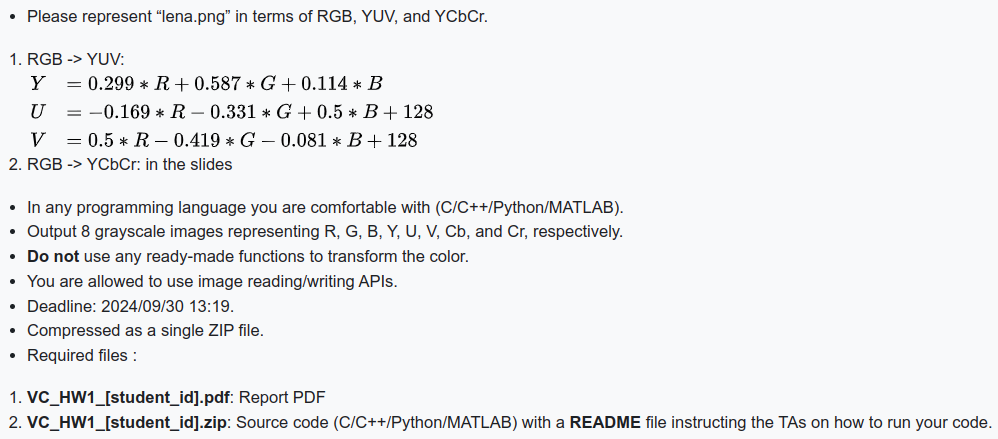

# Homework #1 – Color Transform

> Author: 312553024 江尚軒  
> Date: 2024/09/27



## How to run?

1. Move into this folder
    
    ```bash
    cd ./VC_HW1_312553024/
    ```
    
2. Create this conda environment
    
    ```bash
    conda env create -f environment.yml
    ```
    
3. Activate this conda environment
    
    ```bash
    conda activate 1131-video-compression-HW1
    ```
    
4. Run this code
    
    ```bash
    python src/color_transform.py
    ```
    
5. The images representing R, G, B, Y, U, V, Cb, and Cr will be saved in the `image/` folder