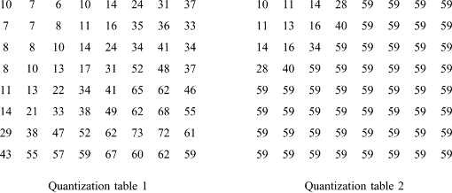

# Homework #4 – Entropy Coding

> Author: 312553024 江尚軒  
> Date: 2024/11/08

## Requirement

- Run length encoding and run length decoding
    - 8x8 block-based DCT coefficients of “lena.png.”
    - Quantize the coefficients with the two quantization tables.
    - Use a raster scan to visit all 8x8 blocks in these images.
    - Do the run length encoding by using a zigzag scan to visit all pixels in one block.
    - Do the run length decoding and IDCT to recover the image.
    - Compare the encoded image sizes with the two quantization tables.
- **Deadline: 2024/11/11 1:19 PM**
    - Upload to E3 with required files :
    - **VC_HW4_[student_id].pdf**: Report PDF
    - **VC_HW4_[student_id].zip**: Zipped source code (C/C++/Python/MATLAB) and a **README** file



## How to run?

1. Move into this folder
    
    ```bash
    cd VC_HW4_312553024/
    ```
    
2. Create this conda environment
    
    ```bash
    conda env create -f environment.yml
    ```
    
3. Activate this conda environment
    
    ```bash
    conda activate 1131-video-compression-HW4
    ```
    
4. For entropy coding, please run this code
    
    ```bash
    python src/entropy_coding.py
    ```
    
5. The encoded size, running time, and PSNR will be shown on the terminal
6. The encoded image will be saved in the `encoded_image/` folder
7. The decoded image will be saved in the `decoded_image/` folder
8. The decoded image comparison will also be saved in the `decoded_image/` folder